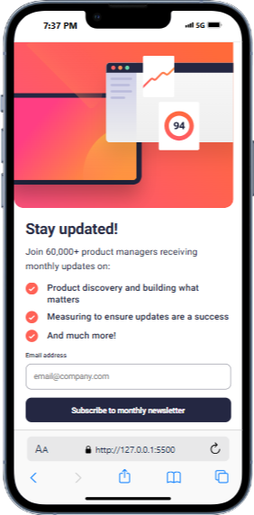

# Frontend Mentor - Newsletter sign-up form with success message solution

This is a solution to the [Newsletter sign-up form with success message challenge on Frontend Mentor](https://www.frontendmentor.io/challenges/newsletter-signup-form-with-success-message-3FC1AZbNrv). Frontend Mentor challenges help you improve your coding skills by building realistic projects. 

## Table of contents

- [Overview](#overview)
  - [The challenge](#the-challenge)
  - [Screenshot](#screenshot)
  - [Links](#links)
- [My process](#my-process)
  - [Built with](#built-with)
  - [What I learned](#what-i-learned)
  - [Continued development](#continued-development)
  - [Useful resources](#useful-resources)
- [Author](#author)
- [Acknowledgments](#acknowledgments)

## Overview

### The challenge

Users should be able to:

- Add their email and submit the form
- See a success message with their email after successfully submitting the form
- See form validation messages if:
  - The field is left empty
  - The email address is not formatted correctly
- View the optimal layout for the interface depending on their device's screen size
- See hover and focus states for all interactive elements on the page

### Screenshot


[desktop-image](./screenshots/Macbook-Air-127.0.0.1.png)

### Links

- Solution URL: [Add solution URL here](https://your-solution-url.com)
- Live Site URL: [Add live site URL here](https://your-live-site-url.com)

## My process

### Built with

- Semantic HTML5 markup
- CSS custom properties
- Flexbox
- Email Regular Expression 
- Screenshoting for mobile and desktop view
- [React](https://reactjs.org/) - JS library
- [Next.js](https://nextjs.org/) - React framework
- [Styled Components](https://styled-components.com/) - For styles

### What I learned

I learnt a lot most expecially email regular expression, and how elements override one another and how to debug.

To see how you can add code snippets, see below:

```html
<h1>Some HTML code I'm proud of</h1>
```
```css
.proud-of-this-css {
  color: papayawhip;
}
```
```js
const proudOfThisFunc = () => {
  console.log('🎉')
}
```

If you want more help with writing markdown, we'd recommend checking out [The Markdown Guide](https://www.markdownguide.org/) to learn more.

### Continued development

am still focusing on knowing how to structure my HTML very well.

**Note: Delete this note and the content within this section and replace with your own plans for continued development.**

### Useful resources

- [Example resource 1](https://www.w3schools.com/) - This helped me for understanding HTML, CSS AND JAVASCRIPT AND PYTHON AND C++ AS WELL. I really liked this pattern and will use it going forward.
- [Example resource 2](https://www.tutorialspoint.com/index.htm) - This is an amazing article which helped me finally understand what is react native . I'd recommend it to anyone still learning this concept.

## Author

- Website - [EMMANUEL LAWAL](https://newsletter-sign-up-with-success-message-main-blush.vercel.app/)
- Frontend Mentor - [@emmanuelayo-del](https://www.frontendmentor.io/profile/emmanuelayo-del)
- Twitter - [@AyomideEmm99555](https://x.com/AyomideEmm99555)

## Acknowledgments

I am giving a showout to my mentor Bro. Sotunde Emmanuel who really helped me well and led me through in this project and also thought me well on some new things. God Bless You.
